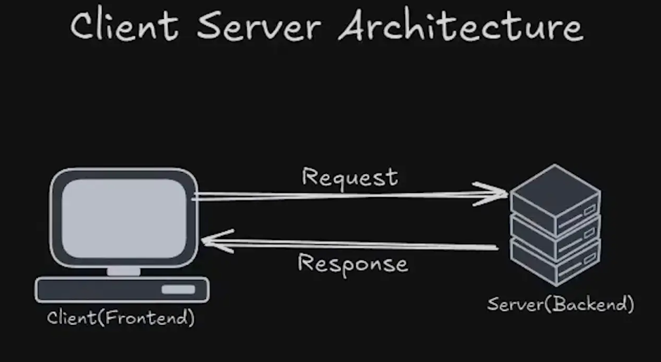

# what is Backend and client server Architecture ?
<b>Client(Frontend)</b>
 
A client is a computer or software that requests services, resources, or data from a server over a network. It interacts or communicate  with the server by sending requests and receiving responses, typically through a web browser, application, or other interface.
 
<b>Example:</b>web browsers like Google Chrome, Mozilla Firefox or Safari are common client applications that request data from a server to render web pages.
 

<b>Server(backend)</b>
 
A Server, on the other hand, is a remote computer or system that provides data, resources or services to clients. It listens to incoming client requests, processes them and sends the required information or (response) back. A server can handle multiple client requests simultaneously.
  

# CLI vs. GUI
CLI (Command-Line Interface) and GUI (Graphical User Interface) are two different ways of interacting with a computer or software.
 
What is CLI?
 
Definition: A text-based interface where users type commands to perform tasks.
 
How It Works: You interact with the system by typing specific commands into a terminal or console.
 
Examples: Command Prompt in Windows, Terminal in macOS or Linux.
  
What is GUI?
 
Definition: A visual interface where users interact with the system through graphical elements like windows, icons, buttons, and menus.
 
How It Works: Users perform tasks by clicking, dragging, and dropping using a mouse or touchpad.
 
Examples: Windows OS, macOS, Ubuntu Desktop.

